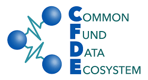

# `ISBDS: CFDE Edition` 

 * __ISBDS__: Independent Study in Biomedical Data Science
 * __CFDE__: Common Fund Data Ecosystem

The CFDE Edition of ISBDS is focused on effective use and integration
of NIH Common Fund datasets for biomedical discovery.

Students will have access to project templates, example code, documentation,
and other resources, based on CFDE scientific use cases, which can readily
be extended and customized for novel independent study projects.

This repository is intended for research templates, example code, workflows,
and related documentation.

The first session of __ISBDS: CFDE Edition__ is scheduled for the summer
of 2024, as a fully remote, online course. Dates, registration, and other
details available via:

__[ISBDS-CFDE Home Page](https://datascience.unm.edu/isbdscourse_cfde/)__

See also:

* [CFDE NIH Home Page](https://commonfund.nih.gov/dataecosystem)
* [CFDE Consortium Home Page](https://nih-cfde.org/)
